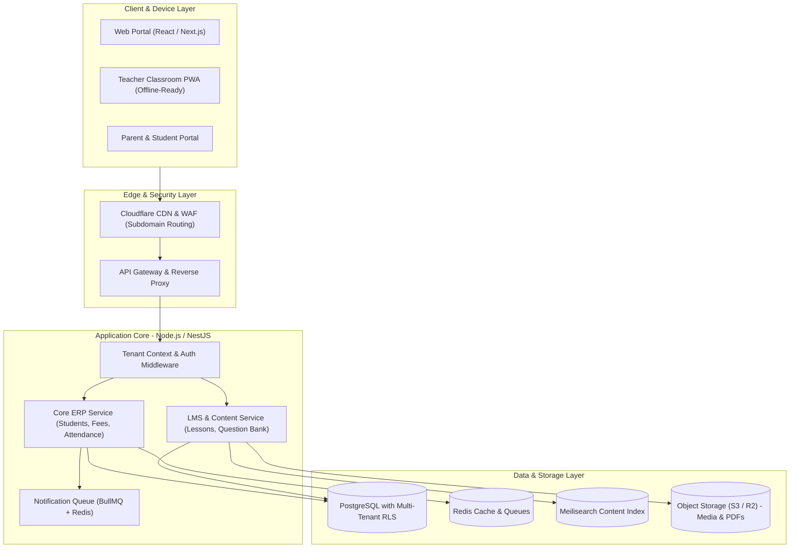

# Goan Ki Pathshala (गाँव की पाठशाला)
## Production-Grade Multi-Tenant School Management & EdTech SaaS Platform

---

## 1. Executive Summary & Vision
**Goan Ki Pathshala** is designed to bring production-grade, LEAD-school-level digital infrastructure and modern school administration to budget and rural schools, Tier 2/3 private institutions, and educational networks.

The system combines:
1. **Content-Heavy Learning Management (LMS / CMS):** Digitized curricula, interactive lesson plans, teacher guides, audio-visual content, and question banks.
2. **School Operations & ERP:** Multi-tenant student directory, role-based access control (RBAC), daily attendance, gradebook & examination, and fee collection/invoicing.
3. **Resilient Connectivity:** Offline-ready capability for classroom presentation and attendance taking in low-bandwidth environments.

---

## 2. Technology Stack & Framework Choices

| Layer | Technology Selected | Rationale |
| :--- | :--- | :--- |
| **Frontend Web** | **React (Next.js 14+ / Vite)** + TypeScript + Tailwind CSS + shadcn/ui | Fast SSR/SSG for content portals, clean component design system, strong typing. |
| **Backend API** | **Node.js (NestJS / Express)** + TypeScript | Enterprise architecture, modular domain-driven design, robust ecosystem. |
| **Database** | **PostgreSQL (v15+)** | ACID compliance for grades and fees; Row-Level Security (RLS) for multi-tenancy. |
| **ORM / Data Access**| **Prisma** or **Drizzle ORM** | Type-safe migrations, dynamic schema filtering by `tenant_id`. |
| **Caching & Queues**| **Redis** + **BullMQ** | Session caching, background PDF report-card generation, WhatsApp/SMS alerts. |
| **CMS / Content Engine**| **Headless CMS (Directus / Strapi)** or Embedded CMS Models | Schema-driven educational content management and asset workflows. |
| **Search Engine** | **Meilisearch** or **Elasticsearch** | Sub-second full-text search across curricula, lesson plans, and circulars. |
| **Storage & CDN** | **AWS S3 / Cloudflare R2** + Cloudflare CDN | Zero-buffering digital content, video/PDF worksheets delivery. |

---

## 3. Multi-Tenancy Architecture

We adopt a **Shared Database with Isolated Tenant Identifiers (Row-Level Security / Tenant Schema Pattern)**:
* Every school is a **Tenant** with a unique `tenant_id` (UUID) and custom slug (e.g., `dps-village.goankipathsala.in` or custom domain `portal.schoolname.edu`).
* **Tenant Resolution Middleware:**
  1. Extract subdomain (`req.headers.host`) or `X-Tenant-ID` header.
  2. Validate active subscription and resolve school context.
  3. Enforce `tenant_id` on all database queries automatically using Prisma/Drizzle middleware or PostgreSQL Row-Level Security (RLS).

---

## 4. System Architecture Diagram



---

## 5. Core Modules Breakdown

### Phase 1: Foundation & Operations Core (ERP)
1. **Multi-Tenant & Security Engine:**
   * Tenant provisioning, subscription plan limits, domain mapping.
   * RBAC: `SuperAdmin`, `SchoolAdmin`, `Teacher`, `Accountant`, `Parent`, `Student`.
2. **Academic Structure:**
   * Academic Sessions/Years, Grades/Classes, Sections, Subjects, Class Timetable.
3. **Student & Guardian Directory:**
   * Enrolment management, student profiles, parent/guardian linking.
4. **Attendance Management:**
   * Daily/period attendance logging, real-time absence notification queues.
5. **Fee & Billing Ledger:**
   * Custom fee structures (term, monthly, bus fees), receipt generation, status tracking.

### Phase 2: Content & Learning Management (LMS / Classroom)
1. **Curriculum & Lesson Planner:**
   * Multi-board syllabus support (CBSE, State Boards).
   * Day-by-day lesson plans with teacher instructions and objectives.
2. **Interactive Content Engine:**
   * Audio-visual slide presentations, downloadable worksheets, teacher resources.
3. **Assessment & Question Bank:**
   * Question repository categorized by subject, chapter, and Bloom's taxonomy difficulty.
   * Offline/Online exam creation and automated gradebook aggregation.

### Phase 3: Communication & Offline-First Classroom
1. **Circulars & Noticeboard:**
   * School-wide and class-specific notices with read receipts.
2. **PWA / Offline Classroom Mode:**
   * Pre-downloading lesson packages on the teacher app for uninterrupted teaching during power/internet outages.

---

## 6. Monorepo Directory Structure

The project will be organized as a clean, modular TypeScript monorepo (using Turborepo or npm workspaces):

```
goankipathsala/
├── apps/
│   ├── api/                   # Node.js (NestJS / Express) backend service
│   ├── web/                   # Main React (Next.js) Admin & School Portal
│   └── classroom-pwa/         # Offline-capable Teacher classroom interface
├── packages/
│   ├── database/              # Prisma / Drizzle schemas, migrations, client
│   ├── shared-types/          # Shared TypeScript interfaces and DTOs
│   ├── ui/                    # Shared Tailwind/React UI component library
│   └── config/                # ESLint, TypeScript, and Tailwind shared configs
├── docs/                      # Architecture, API specs, and database schema docs
├── docker-compose.yml         # Local Postgres, Redis, Meilisearch development setup
└── README.md
```
