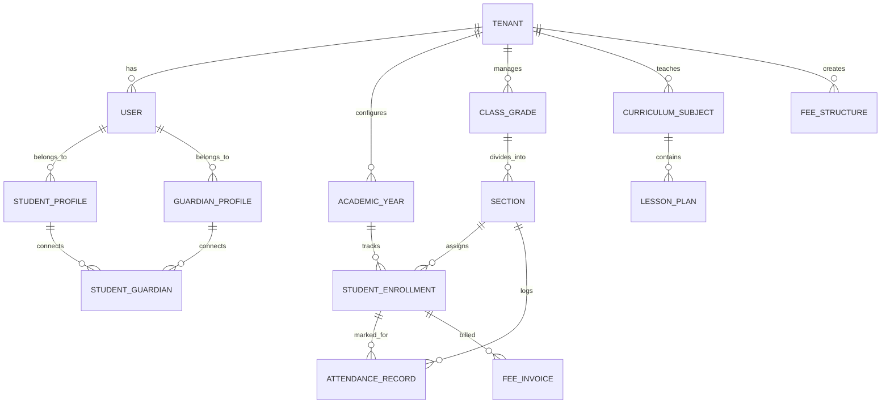

# Multi-Tenant Data Model Specifications

This document outlines the multi-tenant PostgreSQL schema design with strict tenant isolation.

---

## 1. Core Principles
1. **Multi-Tenancy:** All school-scoped tables contain `tenant_id UUID NOT NULL REFERENCES tenants(id) ON DELETE CASCADE`.
2. **PostgreSQL RLS (Row-Level Security):** Can be enforced at database connection level using `current_setting('app.current_tenant_id')`.
3. **Auditing:** All major tables include `created_at`, `updated_at`, `created_by`, `updated_by`.

---

## 2. Entity Relationship Overview

---

## 3. Schema Definitions

### 3.1. Tenant & System Management
* **`tenants`**
  * `id` (UUID, Primary Key)
  * `name` (VARCHAR, e.g., "Saraswati Vidya Mandir")
  * `slug` (VARCHAR, Unique, e.g., "svm-raipur")
  * `custom_domain` (VARCHAR, Nullable, e.g., "portal.svmraipur.edu")
  * `plan` (`FREE`, `STANDARD`, `PREMIUM`)
  * `status` (`ACTIVE`, `SUSPENDED`, `ONBOARDING`)
  * `settings` (JSONB - grading system, logo, brand colors, contact details)
  * `created_at`, `updated_at`

### 3.2. Identity & Access Control (RBAC)
* **`users`**
  * `id` (UUID, Primary Key)
  * `tenant_id` (UUID, Foreign Key)
  * `email` (VARCHAR, Nullable, unique per tenant)
  * `phone` (VARCHAR, Indexed, unique per tenant)
  * `password_hash` (VARCHAR)
  * `role` (`SUPERADMIN`, `SCHOOL_ADMIN`, `TEACHER`, `ACCOUNTANT`, `STUDENT`, `GUARDIAN`)
  * `status` (`ACTIVE`, `INACTIVE`)
  * `last_login_at` (TIMESTAMP)

### 3.3. Academic Hierarchy
* **`academic_years`**
  * `id` (UUID, Primary Key)
  * `tenant_id` (UUID)
  * `name` (VARCHAR, e.g., "2026-2027")
  * `start_date` (DATE)
  * `end_date` (DATE)
  * `is_current` (BOOLEAN)

* **`class_grades`**
  * `id` (UUID, Primary Key)
  * `tenant_id` (UUID)
  * `name` (VARCHAR, e.g., "Class 6", "Class 10")
  * `numerical_order` (INT, 1 to 12)

* **`sections`**
  * `id` (UUID, Primary Key)
  * `tenant_id` (UUID)
  * `class_grade_id` (UUID, Foreign Key)
  * `name` (VARCHAR, e.g., "A", "B", "Rose")
  * `class_teacher_id` (UUID, Nullable, Foreign Key to users)

### 3.4. Students & Parents (SIS)
* **`student_profiles`**
  * `id` (UUID, Primary Key)
  * `tenant_id` (UUID)
  * `user_id` (UUID, Foreign Key to users)
  * `admission_number` (VARCHAR, Unique per tenant)
  * `first_name`, `last_name`
  * `dob` (DATE), `gender` (`MALE`, `FEMALE`, `OTHER`)
  * `blood_group` (VARCHAR)
  * `address` (JSONB)
  * `emergency_contact` (VARCHAR)

* **`student_enrollments`**
  * `id` (UUID, Primary Key)
  * `tenant_id` (UUID)
  * `student_id` (UUID, Foreign Key)
  * `academic_year_id` (UUID, Foreign Key)
  * `section_id` (UUID, Foreign Key)
  * `roll_number` (INT)
  * `status` (`ENROLLED`, `PROMOTED`, `TRANSFERRED`, `DROPPED`)

* **`student_guardians`**
  * `id` (UUID, Primary Key)
  * `tenant_id` (UUID)
  * `student_id` (UUID, Foreign Key)
  * `guardian_user_id` (UUID, Foreign Key to users)
  * `relationship` (`FATHER`, `MOTHER`, `GUARDIAN`)
  * `is_primary` (BOOLEAN)

### 3.5. Attendance Module
* **`attendance_records`**
  * `id` (UUID, Primary Key)
  * `tenant_id` (UUID)
  * `enrollment_id` (UUID, Foreign Key)
  * `date` (DATE)
  * `status` (`PRESENT`, `ABSENT`, `LATE`, `EXCUSED`, `HALF_DAY`)
  * `remarks` (TEXT)
  * `marked_by_user_id` (UUID, Foreign Key)
  * *Constraint:* Unique on `(tenant_id, enrollment_id, date)`

### 3.6. Content & Learning Management (LMS)
* **`curriculum_subjects`**
  * `id` (UUID, Primary Key)
  * `tenant_id` (UUID)
  * `class_grade_id` (UUID, Foreign Key)
  * `name` (VARCHAR, e.g., "Mathematics", "Science", "Hindi")
  * `board` (VARCHAR, e.g., "CBSE", "State Board")

* **`chapters`**
  * `id` (UUID, Primary Key)
  * `tenant_id` (UUID)
  * `subject_id` (UUID, Foreign Key)
  * `chapter_number` (INT)
  * `title` (VARCHAR)
  * `description` (TEXT)

* **`lesson_plans`**
  * `id` (UUID, Primary Key)
  * `tenant_id` (UUID)
  * `chapter_id` (UUID, Foreign Key)
  * `day_number` (INT)
  * `title` (VARCHAR)
  * `learning_objectives` (JSONB - array of objectives)
  * `teacher_guide_notes` (TEXT)
  * `presentation_slides_url` (VARCHAR)
  * `worksheet_asset_url` (VARCHAR)
  * `video_resources` (JSONB)

### 3.7. Fee & Billing Ledger
* **`fee_structures`**
  * `id` (UUID, Primary Key)
  * `tenant_id` (UUID)
  * `academic_year_id` (UUID, Foreign Key)
  * `class_grade_id` (UUID, Foreign Key)
  * `name` (VARCHAR, e.g., "Quarterly Tuition Fee")
  * `amount` (DECIMAL(10, 2))
  * `due_date` (DATE)

* **`fee_invoices`**
  * `id` (UUID, Primary Key)
  * `tenant_id` (UUID)
  * `enrollment_id` (UUID, Foreign Key)
  * `fee_structure_id` (UUID, Foreign Key)
  * `invoice_number` (VARCHAR)
  * `total_amount` (DECIMAL(10, 2))
  * `paid_amount` (DECIMAL(10, 2))
  * `status` (`PENDING`, `PARTIALLY_PAID`, `PAID`, `OVERDUE`)
